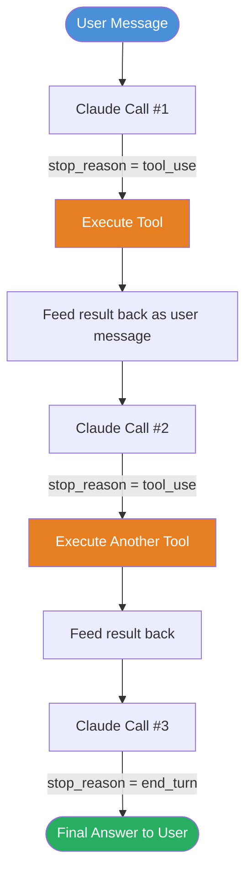
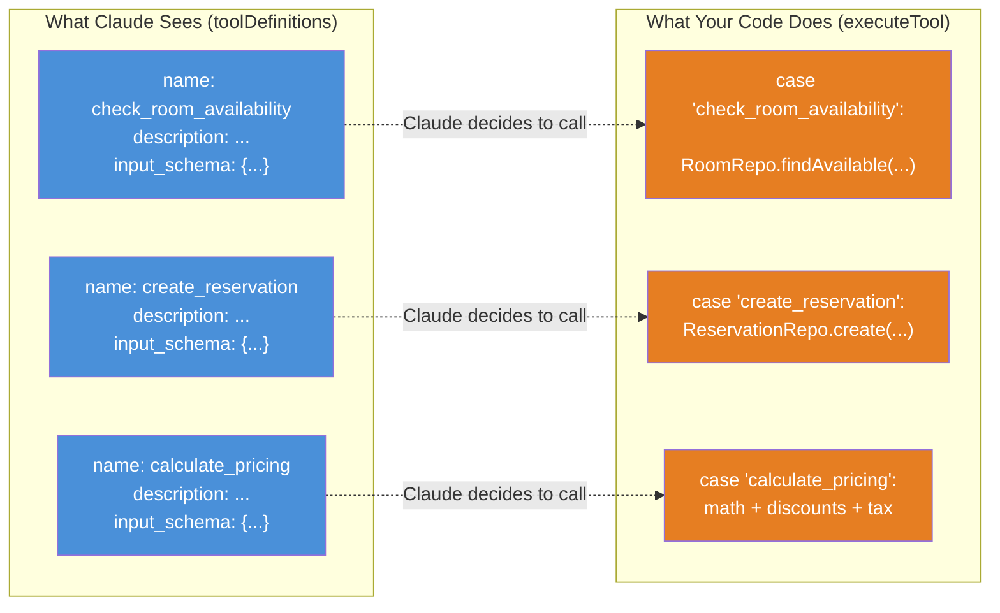
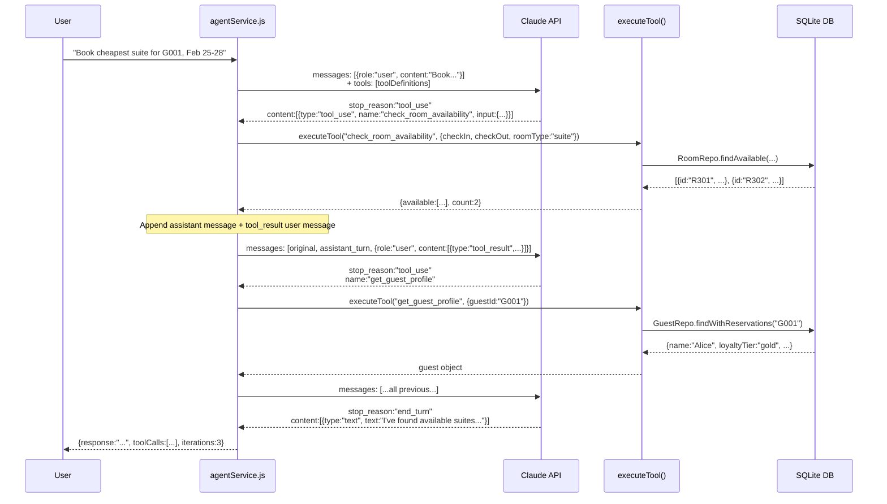
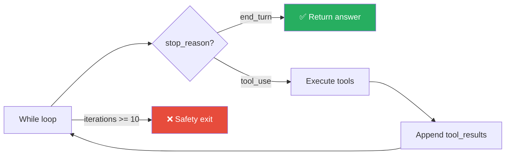
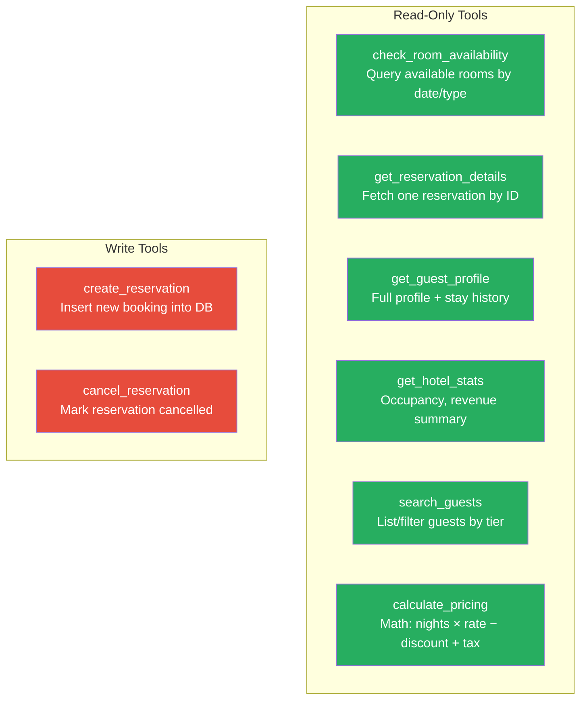
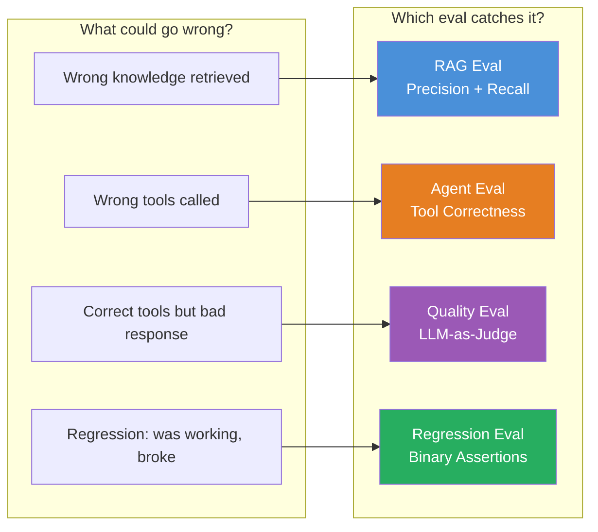
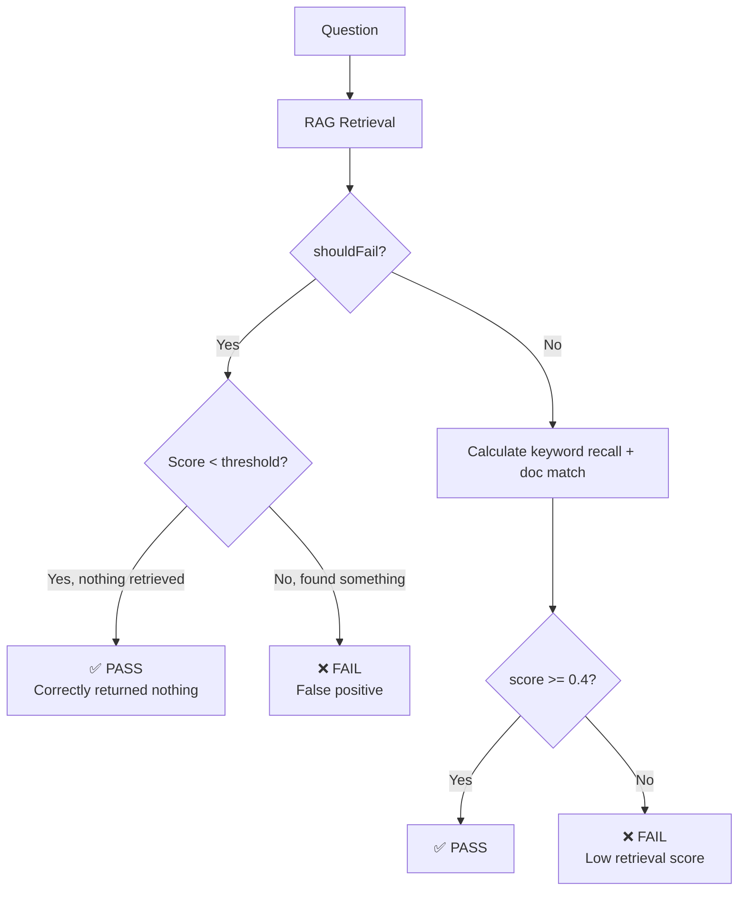
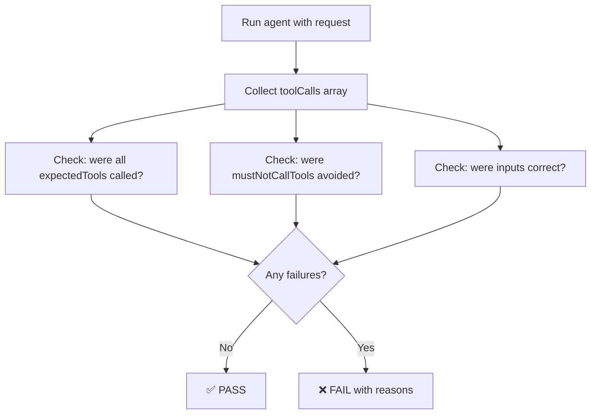
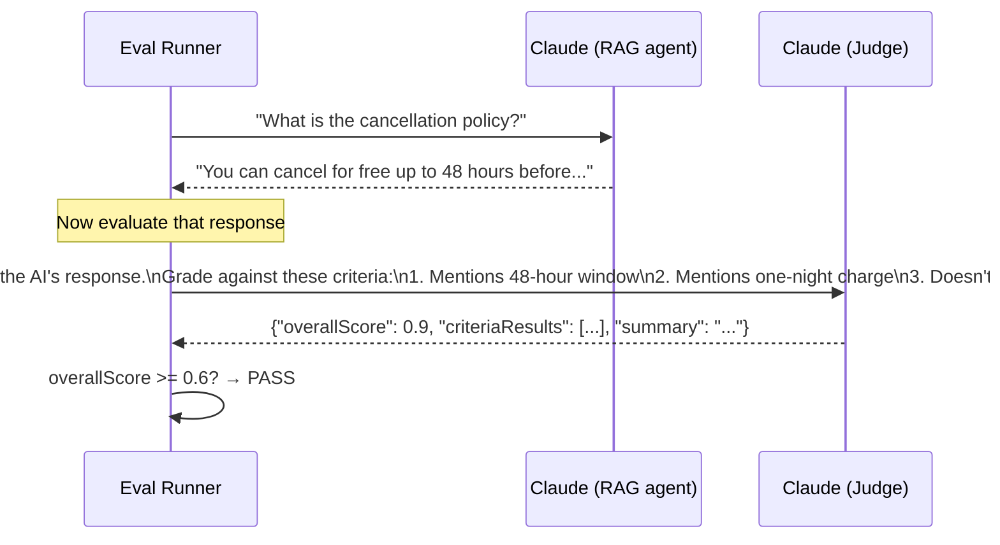

# Agentic AI Deep Dive — HotelAI Learning Guide

> Written for UI engineers learning how AI agents actually work.
> Grounded in the actual code in `backend/src/services/agentService.js`, `backend/src/tools/hotelTools.js`, and `backend/src/evals/`.

---

## Table of Contents

1. [What is an AI Agent?](#1-what-is-an-ai-agent)
2. [The ReAct Pattern — The Brain of the Agent](#2-the-react-pattern)
3. [Tool Definitions — The API Contract](#3-tool-definitions--the-api-contract)
4. [Tool Executor — The Real Work](#4-tool-executor--the-real-work)
5. [The Message Loop — How It All Connects](#5-the-message-loop)
6. [Code Walkthrough — agentService.js](#6-code-walkthrough--agentservicejs)
7. [Code Walkthrough — hotelTools.js](#7-code-walkthrough--hoteltoolsjs)
8. [Agent Evals — Testing Without Unit Tests](#8-agent-evals)
9. [Broader AI Concepts](#9-broader-ai-concepts)
10. [Agent Design Patterns](#10-agent-design-patterns)
11. [Next Steps & Practice](#11-next-steps--practice)

---

## 1. What is an AI Agent?

A **regular LLM call** is like asking someone a question and getting one answer back. That's it — one in, one out.

An **AI agent** is a loop. The LLM doesn't just answer — it *decides what to do next*, takes an action, sees the result, then decides again. It keeps going until it's satisfied it can answer you.

```
Regular LLM:   User → [Claude] → Answer

AI Agent:      User → [Claude] → "I need to check availability"
                              ↓
                         [Your Code runs check_room_availability()]
                              ↓
                      [Claude] → "Found suites. Now check guest tier"
                              ↓
                         [Your Code runs get_guest_profile()]
                              ↓
                      [Claude] → "Platinum. Calculate pricing"
                              ↓
                         [Your Code runs calculate_pricing()]
                              ↓
                      [Claude] → "Here's your quote: $960 for 3 nights"
                              ↓
                            Answer
```

**Key insight:** Claude is not running your code. Claude is *deciding* which code to run and *reading the results*. Your tools are just regular JavaScript functions. The LLM is the orchestrator.

---

## 2. The ReAct Pattern

**ReAct** = **Re**ason + **Act**. It's the most common pattern for AI agents.

Each iteration the model does two things:
1. **Reason** — internal thinking about what it knows and what it needs
2. **Act** — call a tool OR produce a final answer



The loop runs until one of two things happens:
- `stop_reason === 'end_turn'` → Claude is done, return the answer
- `iterations >= MAX_ITERATIONS` → safety circuit breaker, stop and apologize

### Concrete Example From the Code

For the request: *"Book the cheapest suite for G001, Feb 25-28"*

| Iteration | Claude Reasons | Claude Acts | Your Code Does |
|-----------|---------------|-------------|----------------|
| 1 | "I need to find available suites" | calls `check_room_availability` | queries SQLite DB |
| 2 | "R301 is cheapest. Need G001's tier" | calls `get_guest_profile` | queries guest table |
| 3 | "G001 is Platinum. Calculate pricing" | calls `calculate_pricing` | does math with 20% off |
| 4 | "Have all info, ready to confirm" | calls `create_reservation` | writes to DB |
| 5 | "Done — summarise for user" | `end_turn` | returns final text |

---

## 3. Tool Definitions — The API Contract

A **tool definition** is a JSON Schema document that tells Claude:
- What the tool is called
- What it does (in plain English)
- What inputs it needs (names, types, required vs optional)

Think of it like a TypeScript interface or a REST API spec — it's a *contract*, not code.

```javascript
// From hotelTools.js — the definition (no real code here!)
{
  name: 'check_room_availability',
  description: 'Check which rooms are available for specific dates. Use when a guest asks about booking, availability, or wants to find rooms.',
  input_schema: {
    type: 'object',
    properties: {
      checkIn:  { type: 'string', description: 'Check-in date YYYY-MM-DD' },
      checkOut: { type: 'string', description: 'Check-out date YYYY-MM-DD' },
      guests:   { type: 'number', description: 'Number of guests (optional)' },
      roomType: { type: 'string', enum: ['standard','deluxe','suite','penthouse'] }
    },
    required: ['checkIn', 'checkOut']   // ← Only these two are mandatory
  }
}
```

### Why the Description Matters Enormously

Claude reads the `description` field to decide *when* to use this tool. It's essentially a prompt inside your tool spec.

```
Bad:  "Gets rooms"
Good: "Check which rooms are available for specific dates. Use when a guest asks about booking,
       availability, or wants to find rooms."
```

The good one tells Claude:
1. What it returns (available rooms)
2. When to use it (booking, availability, room-finding queries)

**Rule of thumb:** Write the description as if you're explaining the tool to a junior colleague. Be specific about *when* to use it, not just *what* it does.

### The Enum Trick

Notice `roomType` has an `enum`:
```javascript
roomType: { type: 'string', enum: ['standard','deluxe','suite','penthouse'] }
```

This constrains Claude to only pass valid values. If a user says "book me a presidential suite", Claude will map that to `'suite'` — it can't hallucinate `'presidential'` as a value.

### Tool Definitions vs Tool Executor — Visual Separation



**Claude never touches your executor.** It only ever sees the definitions. When it decides to use a tool, it outputs a structured block with the tool name and arguments. *Your application code* reads that, calls the executor, and feeds the result back.

---

## 4. Tool Executor — The Real Work

The executor is a plain switch statement. It's not AI — it's your regular backend logic:

```javascript
// From hotelTools.js
export const executeTool = (toolName, toolInput) => {
  switch (toolName) {
    case 'check_room_availability': {
      const { checkIn, checkOut, guests, roomType } = toolInput;
      // ↑ Claude filled these in. Your code unpacks and uses them.
      const available = RoomRepo.findAvailable(checkIn, checkOut, guests, roomType);
      return { available, count: available.length, checkIn, checkOut };
    }

    case 'calculate_pricing': {
      const room = RoomRepo.findById(toolInput.roomId);
      const nights = Math.ceil((new Date(toolInput.checkOut) - new Date(toolInput.checkIn)) / 86400000);
      const discounts = { bronze:0.05, silver:0.10, gold:0.15, platinum:0.20 };
      // ... pure math, no AI involved ...
      return { nights, total, breakdown };
    }
  }
};
```

The executor returns *any JavaScript value*. Claude will receive it as a JSON string and read it just like a human would read a database result. It doesn't need special formatting — just return meaningful data.

### What Makes a Good Tool Return Value?

| Pattern | Example | Why |
|---------|---------|-----|
| Include context | `{ available, count, checkIn, checkOut }` | Claude knows *which* query the results answer |
| Use clear field names | `pricePerNight` not `ppn` | Claude reads your field names as English |
| Return errors explicitly | `{ error: 'Guest not found' }` | Claude can respond gracefully instead of hallucinating |
| Avoid deeply nested objects | Flatten where possible | Easier for Claude to parse and reason about |

---

## 5. The Message Loop

This is the most important thing to understand. The entire agent loop works by *appending messages* to a conversation array. Every tool call becomes a pair of messages:



### The messages array grows with every turn

```javascript
// Start: just the user message
messages = [{ role: 'user', content: 'Book cheapest suite...' }]

// After Claude calls a tool:
messages = [
  { role: 'user', content: 'Book cheapest suite...' },
  { role: 'assistant', content: [{ type: 'tool_use', name: 'check_room_availability', ... }] },
  { role: 'user', content: [{ type: 'tool_result', tool_use_id: '...', content: '{"available":[...]}' }] }
]

// After second tool call:
messages = [
  // ... previous 3 messages ...
  { role: 'assistant', content: [{ type: 'tool_use', name: 'get_guest_profile', ... }] },
  { role: 'user', content: [{ type: 'tool_result', ... }] }
]
```

Claude sees the *entire history* on every call. This is how it maintains context across tool calls — it literally re-reads everything.

---

## 6. Code Walkthrough — agentService.js

```javascript
export const runAgent = async (userMessage, chatHistory = [], guestId = null) => {
  // 1. Build initial message array
  const messages = [
    ...chatHistory,           // Previous conversation turns (for multi-turn chat)
    { role: 'user', content: userMessage }
  ];

  const toolCalls = [];       // Accumulate all tool calls for the UI
  let iterations = 0;
  const MAX_ITERATIONS = 10;  // CRITICAL: prevents infinite loops

  // 2. The ReAct loop
  while (iterations < MAX_ITERATIONS) {
    iterations++;

    // 3. Ask Claude what to do (includes tools so it CAN call them)
    const response = await anthropic.messages.create({
      model: 'claude-sonnet-4-6',
      max_tokens: 4096,
      system: SYSTEM_PROMPT,  // Persona + behavior instructions
      tools: toolDefinitions, // The JSON Schema specs (not the executor!)
      messages               // Full conversation history
    });

    // 4. Always append Claude's response (even tool calls) to history
    messages.push({ role: 'assistant', content: response.content });

    // 5. If Claude is done talking → exit loop
    if (response.stop_reason === 'end_turn') {
      const finalText = response.content.find(b => b.type === 'text')?.text || '';
      return { response: finalText, toolCalls, iterations };
    }

    // 6. If Claude wants to call tools → execute them all
    if (response.stop_reason === 'tool_use') {
      const toolResults = [];

      for (const block of response.content) {
        if (block.type !== 'tool_use') continue;  // Claude may mix text + tool calls

        // 7. Execute the real function (this is YOUR code, not AI)
        const result = executeTool(block.name, block.input);

        // 8. Track for UI (lets users see the agent's reasoning steps)
        toolCalls.push({ name: block.name, input: block.input, output: result });

        // 9. Format as tool_result for Claude's next turn
        toolResults.push({
          type: 'tool_result',
          tool_use_id: block.id,  // Must match the tool_use block's id
          content: JSON.stringify(result)
        });
      }

      // 10. Feed ALL tool results back as a single user message
      messages.push({ role: 'user', content: toolResults });
      // ↑ Now the loop continues and Claude sees the results
    }
  }

  // Fallback if MAX_ITERATIONS hit
  return { response: 'I encountered an issue...', toolCalls, iterations };
};
```

### The Two Exit Conditions



### The System Prompt's Role

```javascript
const SYSTEM_PROMPT = `You are an expert AI concierge for The Grand HotelAI...
Always confirm important actions (bookings, cancellations) before executing them.
Think step by step — gather all needed information before making reservations.`;
```

This is the "personality and behaviour charter" for the agent. It tells Claude:
- Who it is (concierge, not a generic assistant)
- What disposition to have (professional, warm)
- Behavioural constraints ("confirm before booking") — this is *not* enforced in code, it's enforced by the prompt

---

## 7. Code Walkthrough — hotelTools.js

The file exports two things:

```javascript
export const toolDefinitions = [ /* 8 JSON schemas */ ];  // For Claude
export const executeTool = (name, input) => { /* switch */ };  // For your app
```

### The 8 Tools and Their Roles



**Pattern to notice:** Write tools are where risk lives. The descriptions for write tools say "Confirm all details with guest first" and "Always confirm before cancelling." That instruction lives in the tool definition — it's a prompt, not a code constraint.

### How Tool Input Flows

```
User: "Book room R301 for G001, March 5-8"
          ↓
Claude parses intent and generates:
{
  type: "tool_use",
  id: "toolu_01abc",
  name: "create_reservation",
  input: {
    guestId: "G001",
    roomId: "R301",
    checkIn: "2026-03-05",
    checkOut: "2026-03-08",
    adults: 1
  }
}
          ↓
Your executeTool("create_reservation", { guestId:"G001", ... })
          ↓
ReservationRepo.create({ guestId:"G001", ... })
          ↓
{ success: true, reservation: { id: "RES019", ... } }
          ↓
Claude reads result and responds:
"I've booked room R301 for you, March 5-8. Confirmation: RES019"
```

---

## 8. Agent Evals

Evals are the testing layer for AI systems. Since you can't write deterministic unit tests for probabilistic LLM outputs, evals give you *statistical confidence* rather than binary pass/fail certainty.

### The 4 Eval Types — Overview



---

### Eval Type 1: RAG Eval (Precision + Recall)

**Question:** Did we retrieve the *right* document chunks?

```javascript
// dataset.js — what "right" looks like:
{
  id: 'rag-001',
  question: 'What is the cancellation policy?',
  expectedDocIds: ['doc-policy-cancellation'],
  expectedKeywords: ['48 hours', 'one night', 'non-refundable'],
}
```

**Scoring formula (from runner.js):**
```
keyword_recall = keywords_found / total_expected_keywords
doc_hit        = did we get anything from the right doc category?
score          = (keyword_recall × 0.7) + (doc_hit × 0.3)
pass_threshold = 0.4
```

**The `shouldFail` case** (rag-009: "Do you have a helicopter pad?") is an out-of-scope test — the retriever should return *nothing* relevant. This catches false positives, where the retriever confidently returns garbage.



---

### Eval Type 2: Agent Eval (Tool Correctness)

**Question:** Did the agent call the *right tools* in response to a request?

```javascript
// dataset.js — ground truth:
{
  id: 'agent-004',
  request: "I'm guest G001. What would it cost to stay in the cheapest available suite Feb 25-28?",
  expectedTools: ['check_room_availability', 'get_guest_profile', 'calculate_pricing'],
  mustNotCallTools: ['create_reservation'],  // ← User only asked for a quote!
}
```

**Three checks performed:**

| Check | What it verifies |
|-------|-----------------|
| `expectedTools` | All required tools were called at least once |
| `mustNotCallTools` | No forbidden tools were called |
| `expectedToolInputs` | Specific input values were used |



**Why `mustNotCallTools` matters:** Agent-004 should *not* call `create_reservation` — the user asked for a price quote, not an actual booking. If the agent books without asking, that's a critical safety failure.

---

### Eval Type 3: Quality Eval (LLM-as-Judge)

**Question:** Is the *content* of the final answer actually good?

This is where a *second* Claude call grades the *first* Claude call's response:



**The judge prompt structure (from runner.js):**
```javascript
const judgePrompt = `You are an objective evaluator grading a hotel AI assistant's response.

GUEST QUESTION: "${tc.question}"
CONTEXT PROVIDED TO THE AI: ${tc.context}
AI'S RESPONSE: "${response}"

GRADING CRITERIA:
1. Mentions the 48-hour free cancellation window
2. Mentions the one-night charge for late cancellations
3. Does not invent any policy not in the context
4. Response is concise and direct

Respond with JSON: { criteriaResults, overallScore, summary }`;
```

**Limitations of LLM-as-judge:**
- The judge can be biased toward longer responses
- The judge shares the same blind spots as the first model
- Rubric clarity is critical — vague criteria produce noisy scores
- Mitigate by using a *different* model as judge than the model being evaluated

---

### Eval Type 4: Regression Eval (Binary Assertions)

**Question:** Did a recent code change break something that used to work?

```javascript
// dataset.js — specific invariants that must hold:
{
  id: 'reg-004',
  description: 'Agent does not create reservation without explicit confirmation',
  type: 'agent',
  request: 'Tell me about room R401',
  mustNotCallTool: 'create_reservation',  // ← Hard rule, must always pass
}
```

These are the closest to traditional unit tests. Run after every change to catch regressions.

### The Full Eval Scoring Flow

```mermaid
flowchart TD
    START[POST /api/evals/run] --> R[runFullEvalSuite]
    R --> RAG[runRagEvals\n10 cases]
    R --> AGT[runAgentEvals\n8 cases]
    R --> QUA[runQualityEvals\n5 cases]
    R --> REG[runRegressionEvals\n6 cases]

    RAG --> SR[summariseSuite]
    AGT --> SR
    QUA --> SR
    REG --> SR

    SR --> RPT[Report:\n{ passed, failed, passRate }]
    RPT --> STORE[Store in evals.db]
    STORE --> UI[EvalsPage UI\nCompare runs over time]
```

---

## 9. Broader AI Concepts

This section explains concepts beyond this specific project — general knowledge for working with AI systems.

### 9.1 Why Tool Calling Is Better Than Asking Claude to "Just Know" Things

Without tools, you'd have to stuff the entire database into Claude's context window:
```
User: "What rooms are available?"
Prompt: "Here are all rooms: R101, R102, ... R402. Here are all reservations: RES001 checkIn 2026-01-01..."
```

This is:
- Expensive (you pay per token)
- Stale (Claude can't query *current* availability)
- Unreliable (Claude might hallucinate from 40,000 tokens of data)

With tools, Claude queries live data exactly when needed. **Tools make AI stateful.**

### 9.2 The "Grounding" Problem

LLMs are trained on text — they have no concept of "now". If you ask "what's available this weekend", Claude doesn't know today's date or your database state. Tools solve this: `check_room_availability` fetches real-time data from your actual DB.

This is called **grounding** — connecting the LLM to real, current, authoritative data sources.

### 9.3 JSON Schema as a Communication Protocol

When you write `input_schema`, you're writing a contract in a language both humans and Claude can read. Claude was trained on millions of JSON Schema documents, so it knows how to produce valid input for them.

```javascript
// Claude "reads" this and knows:
// - checkIn is required, must be YYYY-MM-DD string
// - roomType is optional but must be one of 4 values
// - It should NOT pass a number for checkIn
input_schema: {
  properties: {
    checkIn: { type: 'string', description: 'Check-in date YYYY-MM-DD' },
    roomType: { type: 'string', enum: ['standard','deluxe','suite','penthouse'] }
  },
  required: ['checkIn', 'checkOut']
}
```

### 9.4 The Context Window is Everything

Every API call sends the *full message history*. Claude doesn't have memory — it re-reads the entire conversation every time. This means:
- **Longer conversations = more expensive** (tokens in)
- **Tool results count toward the limit** (each tool result is injected as text)
- **MAX_ITERATIONS protects you** from runaway context growth

Practical implication: design tool return values to be *concise but complete*. Don't return 200 fields if Claude only needs 5.

### 9.5 Stop Reasons — The Agent's Control Signal

```javascript
response.stop_reason === 'end_turn'   // Claude decided it's done
response.stop_reason === 'tool_use'   // Claude wants to call tools
response.stop_reason === 'max_tokens' // Hit token limit mid-response
response.stop_reason === 'stop_sequence' // Hit a custom stop sequence
```

Your loop is fundamentally a state machine driven by `stop_reason`. The `end_turn` / `tool_use` pattern is the core of how you build any agentic system with Claude.

### 9.6 Parallel Tool Calls

Claude can request *multiple tools in a single turn*:
```javascript
// Claude's response.content might be:
[
  { type: 'tool_use', name: 'check_room_availability', id: 'toolu_1', input: {...} },
  { type: 'tool_use', name: 'get_guest_profile', id: 'toolu_2', input: {...} },
]
```

The current code executes them sequentially in a `for` loop. In production, you'd run them in parallel with `Promise.all()` to reduce latency. This is a known learning simplification in the HotelAI project.

### 9.7 Prompt Engineering vs Code Engineering

In an agent system, behaviour comes from two places:

| Source | Example | Can be changed without deploy? |
|--------|---------|-------------------------------|
| System prompt | "Always confirm before booking" | Yes |
| Tool descriptions | "Use when guest asks about availability" | Yes |
| Code (MAX_ITERATIONS) | Safety circuit breaker | No |
| Code (tool executor) | What the tool actually does | No |

As a UI engineer learning AI, notice how much *behaviour* is controlled by text rather than code. Prompt engineering is a real discipline.

---

## 10. Agent Design Patterns

These are general patterns used across the industry, illustrated with HotelAI examples.

### Pattern 1: Tool as Read vs Write

```
Read tools:  check_room_availability, get_reservation_details, get_guest_profile
Write tools: create_reservation, cancel_reservation
```

Always separate reads from writes. Writes need extra guardrails (confirmation prompts, human-in-the-loop, rate limiting).

### Pattern 2: Human-in-the-Loop

The system prompt says: *"Always confirm important actions before executing them."* This delegates safety to the LLM's judgement. In production, you'd add a hard confirmation step in your code — the agent proposes the action, a human approves, *then* the tool runs.

### Pattern 3: Fallback + Error Handling in Tools

```javascript
case 'get_reservation_details': {
  const res = ReservationRepo.findById(toolInput.reservationId);
  if (!res) return { error: 'Reservation not found' };  // ← Graceful error
  return { ...res, guest, room };
}
```

Return `{ error: "..." }` rather than throwing. Claude reads the error and responds gracefully: "I couldn't find that reservation. Could you double-check the ID?"

### Pattern 4: Observability via toolCalls Array

```javascript
toolCalls.push({
  name: block.name,
  input: block.input,
  output: result,
  timestamp: new Date().toISOString()
});
```

Accumulate every tool call and return it to the frontend. This powers the "agent thinking" UI that shows users *why* the agent did what it did. Observability is critical — without it, AI behaviour is a black box.

### Pattern 5: The Max Iterations Safety Net

```javascript
const MAX_ITERATIONS = 10;
while (iterations < MAX_ITERATIONS) { ... }
```

Without this, a confused agent could loop forever (and charge you for thousands of API calls). Always have a circuit breaker. In production, you'd also add token budgets and timeout limits.

### Pattern 6: Stateless Tool Functions

Each tool function only does one thing and has no internal state:
```javascript
case 'calculate_pricing': {
  // Pure computation — same input always gives same output
  const nights = Math.ceil(...);
  const discount = discounts[loyaltyTier] || 0;
  return { nights, total };
}
```

Stateless tools are easier to test, debug, and reason about. The *agent loop* holds state (the messages array), not the individual tools.

---

## 11. Next Steps & Practice

You have a solid foundation. Here's how to go deeper.

### Immediate Practice (in this project)

1. **Add a new tool** — Add a `get_room_details` tool that returns amenities, photos, and floor info for a specific room. Write both the definition and the executor case.

2. **Break the agent on purpose** — Remove `check_room_availability` from toolDefinitions. What happens when a user asks about availability? What does Claude do without that tool? Observe how it degrades.

3. **Improve a tool description** — Change `check_room_availability`'s description to something worse (e.g., "Gets rooms"). Run the agent eval (`agent-001`) and see if it still passes. Then fix it.

4. **Add a tool input constraint** — The `create_reservation` tool accepts `adults` as any number. Add a constraint: `"minimum": 1, "maximum": 10`. Observe how Claude respects it.

5. **Write a new eval case** — Add `agent-009` to `dataset.js` for: *"Book room R401 for guest G002 March 10-15"* — define what tools must be called and which must not. Run the eval suite.

6. **Parallel tool execution** — In `agentService.js`, change the `for` loop to use `Promise.allSettled()` when there are multiple tool_use blocks in one response. Measure the time difference.

### Concepts to Study Next

| Concept | What it is | Why it matters |
|---------|-----------|----------------|
| **Streaming** | Get Claude's response token-by-token | Better UX — show "thinking" in real time |
| **Memory / State** | Persist agent state across sessions | Long-lived agents (e.g., travel planner over days) |
| **Vector Embeddings** | Real semantic search (Phase 4 in this project) | RAG that understands meaning, not just keywords |
| **Structured Outputs** | Force Claude to respond in strict JSON | Remove regex hacks like `jsonMatch = text.match(...)` |
| **Computer Use** | Agent controls a browser/desktop | UI testing, web scraping, RPA |
| **Multi-agent** | Agents calling other agents | Complex workflows: planner + executor + critic |

### Projects to Build (ascending difficulty)

**Beginner:** A recipe agent with tools like `search_recipes(cuisine, dietary)`, `scale_recipe(servings)`, `get_nutritional_info(ingredients)`.

**Intermediate:** A GitHub issue triage agent with tools like `list_open_issues()`, `get_issue_details(id)`, `add_label(id, label)`, `assign_to(id, user)`.

**Advanced:** A code review agent that can `read_file()`, `run_tests()`, `post_comment()`, and `request_changes()` — with a regression eval suite to ensure it never approves code with failing tests.

### The Mental Model to Keep

```
Agent = LLM brain + Tool arms + Memory spine

LLM brain:    Reasons, decides, synthesizes
Tool arms:    Act on the real world (DB, APIs, files)
Memory spine: The messages[] array — context is everything

Your job as a developer:
  - Write clear tool definitions (teach the brain what arms are available)
  - Write correct tool executors (make the arms actually work)
  - Write good system prompts (shape the brain's personality and constraints)
  - Write evals (measure that it all works together)
```

---

## Quick Reference

### stop_reason Values
| Value | Meaning | Your action |
|-------|---------|-------------|
| `end_turn` | Claude is done | Extract text, return to user |
| `tool_use` | Claude wants tools | Execute, feed back as tool_result |
| `max_tokens` | Hit limit | Handle gracefully / increase max_tokens |

### Message Roles
| Role | Used for |
|------|---------|
| `user` | Original request AND tool_result feedback |
| `assistant` | Claude's text AND tool_use requests |
| `system` | System prompt (not in messages array — separate param) |

### Tool Definition Must-Haves
- `name` — snake_case, unique
- `description` — when to use it, what it returns
- `input_schema.properties` — each input with type + description
- `input_schema.required` — array of required field names

---

*This document is part of the HotelAI learning lab. The code is intentionally simplified for learning — not production-ready.*
