# RAG Service & Eval System — Detailed Explanation

## Table of Contents

1. [What RAG Is and Why It Exists](#1-what-rag-is-and-why-it-exists)
2. [The Knowledge Base (documents.js)](#2-the-knowledge-base-documentsjs)
3. [Embedding: Two Approaches Side-by-Side](#3-embedding-two-approaches-side-by-side)
   - [simpleEmbed — 44-dim binary keyword vector](#simpleembed--44-dim-binary-keyword-vector)
   - [openaiEmbed — 1536-dim float vector](#openaiembed--1536-dim-float-vector)
   - [Why the difference matters](#why-the-difference-matters)
4. [The VectorStore Class](#4-the-vectorstore-class)
   - [Chunking](#chunking)
   - [Indexing](#indexing)
   - [Cosine Similarity](#cosine-similarity)
   - [Retrieval](#retrieval)
5. [Store Singletons and Fallback Logic](#5-store-singletons-and-fallback-logic)
6. [ragChat — The Full RAG Pipeline](#6-ragchat--the-full-rag-pipeline)
7. [compareRetrieval — Side-by-Side Debug Tool](#7-compareretrieval--side-by-side-debug-tool)
8. [RAG Eval Setup](#8-rag-eval-setup)
   - [The Eval Dataset (ragEvalCases)](#the-eval-dataset-ragevalcases)
   - [How runRagEvals Works](#how-runragevals-works)
   - [The Scoring Formula](#the-scoring-formula)
   - [The shouldFail / Out-of-Scope Test](#the-shouldfail--out-of-scope-test)
9. [The Other Three Eval Types](#9-the-other-three-eval-types)
   - [Agent Eval](#agent-eval)
   - [Quality Eval (LLM-as-Judge)](#quality-eval-llm-as-judge)
   - [Regression Eval](#regression-eval)
10. [Full Suite and Reporting](#10-full-suite-and-reporting)
11. [Key Concepts to Take Away](#11-key-concepts-to-take-away)

---

## 1. What RAG Is and Why It Exists

A stock LLM (like Claude) knows only what it was trained on up to its knowledge cutoff. It has no idea what your hotel's cancellation policy is, what your spa prices are, or whether valet parking is available. If you ask it anyway, it will guess — and guess confidently. That's called **hallucination**.

**RAG (Retrieval-Augmented Generation)** solves this by adding a retrieval step before generating an answer.

There are two distinct phases:

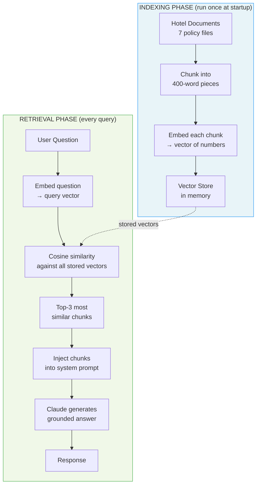
```mermaid
flowchart TB
    subgraph INDEXING ["INDEXING PHASE (run once at startup)"]
        direction TB
        D1["`Hotel Documents
7 policy files`"] --> C["`Chunk into
400-word pieces`"]
        C --> E["`Embed each chunk
→ vector of numbers`"]
        E --> VS["`Vector Store
in memory`"]
    end

    subgraph RETRIEVAL ["RETRIEVAL PHASE (every query)"]
        direction TB
        Q[User Question] --> EQ["`Embed question
→ query vector`"]
        EQ --> SIM["`Cosine similarity
against all stored vectors`"]
        SIM --> TOP["`Top-3 most
similar chunks`"]
        TOP --> INJECT["`Inject chunks
into system prompt`"]
        INJECT --> LLM["`Claude generates
grounded answer`"]
        LLM --> R[Response]
    end

    VS -.->|stored vectors| SIM

    style INDEXING fill:#e8f4f8,stroke:#2196F3
    style RETRIEVAL fill:#f0f8e8,stroke:#4CAF50
```

- **Indexing** (done once): split documents into chunks → embed each chunk → store the vectors in memory.
- **Retrieval** (done on every query): embed the user's question → find the closest chunks → attach them to the prompt.

---

## 2. The Knowledge Base (documents.js)

`backend/src/data/documents.js` exports `hotelDocuments` — an array of 7 plain JavaScript objects. Each object has:

| Field      | Purpose                                      |
|------------|----------------------------------------------|
| `id`       | Unique identifier (e.g. `doc-policy-pets`)   |
| `title`    | Human-readable name                          |
| `category` | Grouping label (`policy`, `amenities`, etc.) |
| `content`  | The raw text the LLM will be given           |

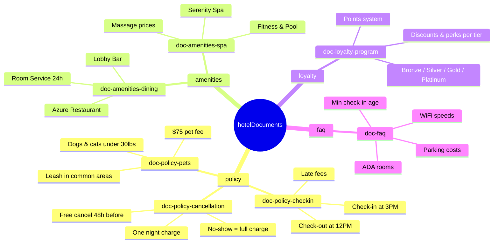
```mermaid
mindmap
  root((hotelDocuments))
    policy
      doc-policy-checkin
        Check-in at 3PM
        Check-out at 12PM
        Late fees
      doc-policy-cancellation
        Free cancel 48h before
        One night charge
        No-show = full charge
      doc-policy-pets
        Dogs & cats under 30lbs
        $75 pet fee
        Leash in common areas
    amenities
      doc-amenities-dining
        Azure Restaurant
        Lobby Bar
        Room Service 24h
      doc-amenities-spa
        Serenity Spa
        Massage prices
        Fitness & Pool
    loyalty
      doc-loyalty-program
        Bronze / Silver / Gold / Platinum
        Discounts & perks per tier
        Points system
    faq
      doc-faq
        Parking costs
        WiFi speeds
        Min check-in age
        ADA rooms
```

These are the only facts the RAG system knows. If a question falls outside these documents, the system should return nothing useful — and that's tested explicitly in the evals.

---

## 3. Embedding: Two Approaches Side-by-Side

`ragService.js` defines two embedding functions. They both take a string and return an array of numbers (a vector). The numbers represent the "meaning" of the text in a high-dimensional space. Texts with similar meaning land close to each other; unrelated texts land far apart.

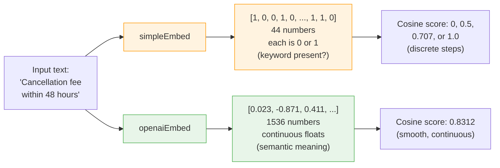
```mermaid
flowchart LR
    TEXT["`Input text:
'Cancellation fee
within 48 hours'`"]

    TEXT --> SE[simpleEmbed]
    TEXT --> OE[openaiEmbed]

    SE --> SV["`[1, 0, 0, 1, 0, ..., 1, 1, 0]
44 numbers
each is 0 or 1
(keyword present?)`"]
    OE --> OV["`[0.023, -0.871, 0.411, ...]
1536 numbers
continuous floats
(semantic meaning)`"]

    SV --> SC["`Cosine score: 0, 0.5,
0.707, or 1.0
(discrete steps)`"]
    OV --> OC["`Cosine score: 0.8312
(smooth, continuous)`"]

    style SE fill:#fff3e0,stroke:#FF9800
    style OE fill:#e8f5e9,stroke:#4CAF50
    style SV fill:#fff3e0,stroke:#FF9800
    style OV fill:#e8f5e9,stroke:#4CAF50
```

### simpleEmbed — 44-dim binary keyword vector

```js
function simpleEmbed(text) {
  const keywords = [
    'cancellation', 'refund', 'policy', 'check-in', 'check-out', 'early', 'late',
    'pet', 'dog', 'cat', 'animal', 'parking', 'valet', 'wifi', 'internet',
    'restaurant', 'dining', 'food', 'breakfast', 'dinner', 'lunch', 'room service',
    'spa', 'pool', 'fitness', 'gym', 'massage', 'wellness',
    'loyalty', 'rewards', 'points', 'tier', 'gold', 'platinum', 'silver', 'bronze',
    'airport', 'transfer', 'shuttle', 'transport',
    'accessible', 'disability', 'ada', 'wheelchair',
    'group', 'booking', 'reservation', 'modify', 'change', 'upgrade',
    'price', 'rate', 'cost', 'fee', 'charge', 'discount',
  ];
  const lowerText = text.toLowerCase();
  return keywords.map(kw => lowerText.includes(kw) ? 1 : 0);
}
```

**How it works:**

There are 44 hand-picked keywords. For a given text, the function produces a 44-element array. Each slot corresponds to one keyword. The value is `1` if that keyword appears anywhere in the text, `0` if it does not.

Example — text: `"Cancellation within 48 hours will charge one night's fee"`:
```
[ 1, 0, 0, 0, 0, 0, 0, 0, ..., 1, 1, 0, ... ]
  ^cancellation               ^fee ^charge
```

**Limitations:**
- **Fixed vocabulary** — if the document says "booking" but the user says "reservation" (not in the list at that position), it might not match.
- **No synonyms** — "canine" and "dog" are not the same keyword; "deposit" and "fee" are not the same.
- **Binary only** — a keyword appearing 10 times has the same weight (1) as one appearing once.
- **No semantics** — there is no understanding of context or sentence structure.
- **Requires no API** — works offline, no cost, instant.

### openaiEmbed — 1536-dim float vector

```js
async function openaiEmbed(text) {
  if (!openai) throw new Error('OPENAI_API_KEY not set — cannot use real embeddings');
  const response = await openai.embeddings.create({
    model: 'text-embedding-3-small',
    input: text,
  });
  return response.data[0].embedding;
}
```

**How it works:**

It sends the text to OpenAI's `text-embedding-3-small` model via API. The model runs the text through a neural network and returns 1536 floating-point numbers, each ranging roughly between -1 and 1.

```
[ 0.0231, -0.8712, 0.4109, 0.0033, -0.2241, ... ] (1536 numbers)
```

These numbers are not individually interpretable — they collectively encode the semantic meaning of the text. Texts with similar meaning produce vectors that point in roughly the same direction in this 1536-dimensional space.

**Advantages over simpleEmbed:**
- **Understands synonyms** — "canine", "dog", "puppy" all land near each other.
- **Context-aware** — "bank" near "river" vs. "bank" near "loan" produce different vectors.
- **Continuous scores** — similarity is a smooth float like 0.847, not just 0 or 0.707.
- **No hand-crafted vocabulary** — it works for any text in any domain.

**Tradeoffs:**
- Requires `OPENAI_API_KEY` set in environment.
- Costs money per API call.
- Adds network latency on every index and retrieval.

### Why the difference matters

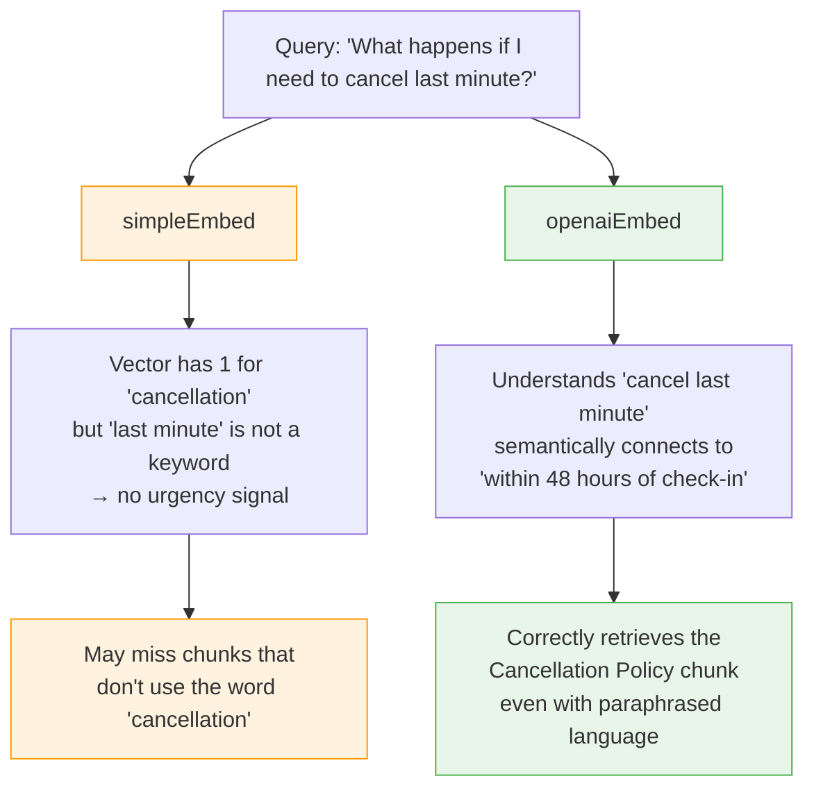
```mermaid
flowchart TD
    Q["Query: 'What happens if I need to cancel last minute?'"]

    Q --> SE[simpleEmbed]
    Q --> OE[openaiEmbed]

    SE --> SEV["`Vector has 1 for 'cancellation'
but 'last minute' is not a keyword
→ no urgency signal`"]
    OE --> OEV["`Understands 'cancel last minute'
semantically connects to
'within 48 hours of check-in'`"]

    SEV --> SER["`May miss chunks that
don't use the word 'cancellation'`"]
    OEV --> OER["`Correctly retrieves the
Cancellation Policy chunk
even with paraphrased language`"]

    style OE fill:#e8f5e9,stroke:#4CAF50
    style SE fill:#fff3e0,stroke:#FF9800
    style OER fill:#e8f5e9,stroke:#4CAF50
    style SER fill:#fff3e0,stroke:#FF9800
```

The `POST /api/ai/embed-compare` endpoint runs both and shows the difference in retrieved chunks and scores — great for seeing this live.

---

## 4. The VectorStore Class

```js
class VectorStore {
  constructor(name, embedFn) {
    this.name = name;
    this.embedFn = embedFn; // accepts sync OR async
    this.documents = [];    // array of chunk objects
    this.embeddings = [];   // parallel array of vectors
    this.isIndexed = false;
  }
  ...
}
```

The class is embedder-agnostic. You pass it any function that takes a string and returns a vector, and it handles everything else. This is a clean example of **dependency injection** — the retrieval logic doesn't care whether the embedder is keyword-based or neural.

### Chunking

```js
chunkDocument(doc, chunkSize = 400) {
  const words = doc.content.split(/\s+/);
  const chunks = [];
  for (let i = 0; i < words.length; i += chunkSize) {
    chunks.push({
      id: `${doc.id}-chunk-${Math.floor(i / chunkSize)}`,
      docId: doc.id,
      title: doc.title,
      category: doc.category,
      content: words.slice(i, i + chunkSize).join(' '),
      chunkIndex: Math.floor(i / chunkSize)
    });
  }
  return chunks;
}
```

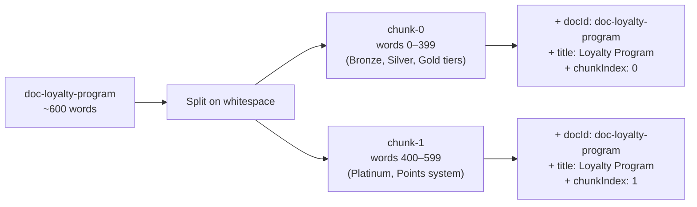
```mermaid
flowchart LR
    DOC["`doc-loyalty-program
~600 words`"]
    DOC --> W[Split on whitespace]
    W --> C0["`chunk-0
words 0–399
(Bronze, Silver, Gold tiers)`"]
    W --> C1["`chunk-1
words 400–599
(Platinum, Points system)`"]

    C0 --> META0["`+ docId: doc-loyalty-program
+ title: Loyalty Program
+ chunkIndex: 0`"]
    C1 --> META1["`+ docId: doc-loyalty-program
+ title: Loyalty Program
+ chunkIndex: 1`"]
```

**Why chunking?** LLMs have a token limit. If you dump every document into every prompt, you hit context limits fast and the LLM has to process irrelevant noise. By splitting documents into 400-word chunks and only injecting the top-3 most relevant ones, the prompt stays focused and efficient.

Each chunk inherits `docId`, `title`, and `category` from its parent document — these are used later in evals to check which document was retrieved.

Most hotel policy documents here are short enough to fit in a single chunk. Longer documents like the FAQ or Loyalty Program produce 2 chunks.

### Indexing

```js
async index(documents) {
  for (const doc of documents) {
    const chunks = this.chunkDocument(doc);
    for (const chunk of chunks) {
      this.documents.push(chunk);
      this.embeddings.push(await this.embedFn(chunk.content));
    }
  }
  this.isIndexed = true;
}
```

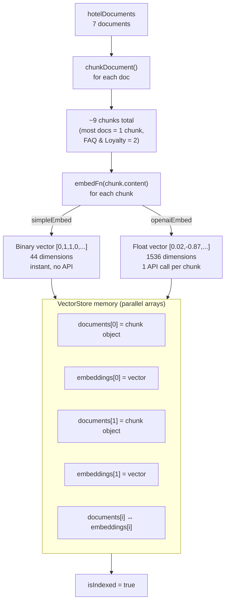
```mermaid
flowchart TD
    DOCS["`hotelDocuments
7 documents`"]
    DOCS --> CHUNK["`chunkDocument()
for each doc`"]
    CHUNK --> CHUNKS["`~9 chunks total
(most docs = 1 chunk,
FAQ & Loyalty = 2)`"]

    CHUNKS --> EMBED["`embedFn(chunk.content)
for each chunk`"]

    EMBED -->|simpleEmbed| BV["`Binary vector [0,1,1,0,...]
44 dimensions
instant, no API`"]
    EMBED -->|openaiEmbed| FV["`Float vector [0.02,-0.87,...]
1536 dimensions
1 API call per chunk`"]

    BV --> STORE
    FV --> STORE

    subgraph STORE["VectorStore memory (parallel arrays)"]
        DA["documents[0] = chunk object"]
        EA["embeddings[0] = vector"]
        DB["documents[1] = chunk object"]
        EB["embeddings[1] = vector"]
        DC["documents[i] ↔ embeddings[i]"]
    end

    STORE --> IDX["isIndexed = true"]
```

For `simpleEmbed`, indexing is instant (no network). For `openaiEmbed`, it makes one API call per chunk.

### Cosine Similarity

```js
cosineSimilarity(a, b) {
  const dot = a.reduce((sum, ai, i) => sum + ai * b[i], 0);
  const magA = Math.sqrt(a.reduce((sum, ai) => sum + ai * ai, 0));
  const magB = Math.sqrt(b.reduce((sum, bi) => sum + bi * bi, 0));
  return magA && magB ? dot / (magA * magB) : 0;
}
```

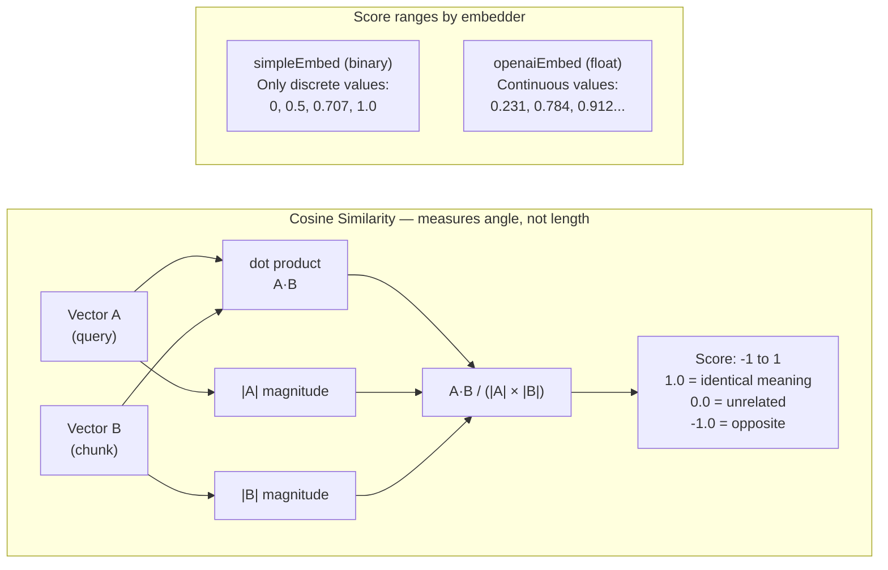
```mermaid
flowchart LR
    subgraph CONCEPT["Cosine Similarity — measures angle, not length"]
        direction LR
        V1["`Vector A
(query)`"]
        V2["`Vector B
(chunk)`"]
        V1 & V2 --> DOT["`dot product
A·B`"]
        V1 --> MA["|A| magnitude"]
        V2 --> MB["|B| magnitude"]
        DOT & MA & MB --> FORMULA["A·B / (|A| × |B|)"]
        FORMULA --> RESULT["`Score: -1 to 1

1.0 = identical meaning
0.0 = unrelated
-1.0 = opposite`"]
    end

    subgraph SCORES["Score ranges by embedder"]
        SE["`simpleEmbed (binary)
Only discrete values:
0, 0.5, 0.707, 1.0`"]
        OE["`openaiEmbed (float)
Continuous values:
0.231, 0.784, 0.912...`"]
    end
```

Cosine similarity measures the **angle** between two vectors, not their length. A result of `1.0` means they point in exactly the same direction (identical meaning). `0` means they are perpendicular (unrelated).

### Retrieval

```js
async retrieve(query, topK = 3) {
  const queryVector = await this.embedFn(query);
  const scored = this.documents.map((doc, i) => ({
    ...doc,
    score: this.cosineSimilarity(queryVector, this.embeddings[i])
  }));

  const results = scored
    .sort((a, b) => b.score - a.score)
    .slice(0, topK)
    .filter(r => r.score > 0);

  return results;
}
```

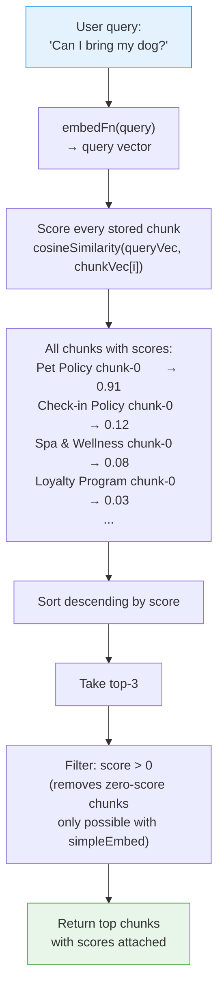
```mermaid
flowchart TD
    Q["`User query:
'Can I bring my dog?'`"]
    Q --> EQ["`embedFn(query)
→ query vector`"]
    EQ --> SCORE["`Score every stored chunk
cosineSimilarity(queryVec, chunkVec[i])`"]

    SCORE --> SCORED["`All chunks with scores:
Pet Policy chunk-0       → 0.91
Check-in Policy chunk-0  → 0.12
Spa & Wellness chunk-0   → 0.08
Loyalty Program chunk-0  → 0.03
...`"]

    SCORED --> SORT["Sort descending by score"]
    SORT --> TOPK["Take top-3"]
    TOPK --> FILTER["`Filter: score > 0
(removes zero-score chunks
only possible with simpleEmbed)`"]
    FILTER --> OUT["`Return top chunks
with scores attached`"]

    style Q fill:#e3f2fd,stroke:#2196F3
    style OUT fill:#e8f5e9,stroke:#4CAF50
```

**Important:** query and document must use the same embedder. Mixing simpleEmbed for indexing and openaiEmbed for query (or vice versa) would produce meaningless similarity scores.

---

## 5. Store Singletons and Fallback Logic

```js
export const keywordStore = new VectorStore('keyword/simpleEmbed', simpleEmbed);

export const realStore = openai
  ? new VectorStore('openai/text-embedding-3-small', openaiEmbed)
  : null;

export const vectorStore = realStore ?? keywordStore;
```

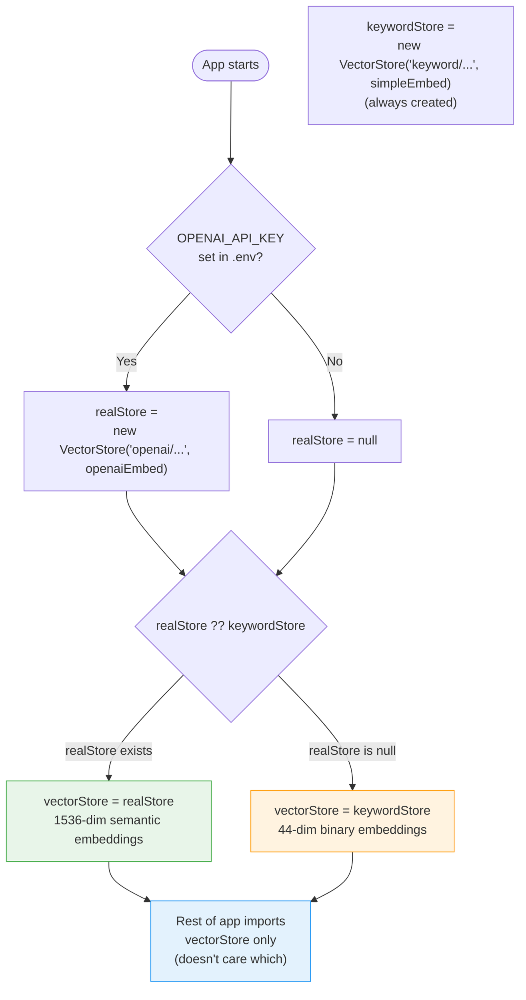
```mermaid
flowchart TD
    START([App starts])
    START --> CHECK{"`OPENAI_API_KEY
set in .env?`"}

    CHECK -->|Yes| RS["`realStore =
new VectorStore('openai/...', openaiEmbed)`"]
    CHECK -->|No| NULL["realStore = null"]

    KS["`keywordStore =
new VectorStore('keyword/...', simpleEmbed)
(always created)`"]

    RS --> PICK{realStore ?? keywordStore}
    NULL --> PICK

    PICK -->|realStore exists| VS1["`vectorStore = realStore
1536-dim semantic embeddings`"]
    PICK -->|realStore is null| VS2["`vectorStore = keywordStore
44-dim binary embeddings`"]

    VS1 & VS2 --> APP["`Rest of app imports
vectorStore only
(doesn't care which)`"]

    style VS1 fill:#e8f5e9,stroke:#4CAF50
    style VS2 fill:#fff3e0,stroke:#FF9800
    style APP fill:#e3f2fd,stroke:#2196F3
```

| Export         | Embedder      | When available             |
|----------------|---------------|----------------------------|
| `keywordStore` | simpleEmbed   | Always (no API key needed) |
| `realStore`    | openaiEmbed   | Only if `OPENAI_API_KEY` is set |
| `vectorStore`  | Either        | Prefers `realStore`, falls back to `keywordStore` |

The rest of the application only ever imports `vectorStore`. It doesn't need to know which embedder is active. This is the **strategy pattern** — swappable implementation behind a stable interface.

---

## 6. ragChat — The Full RAG Pipeline

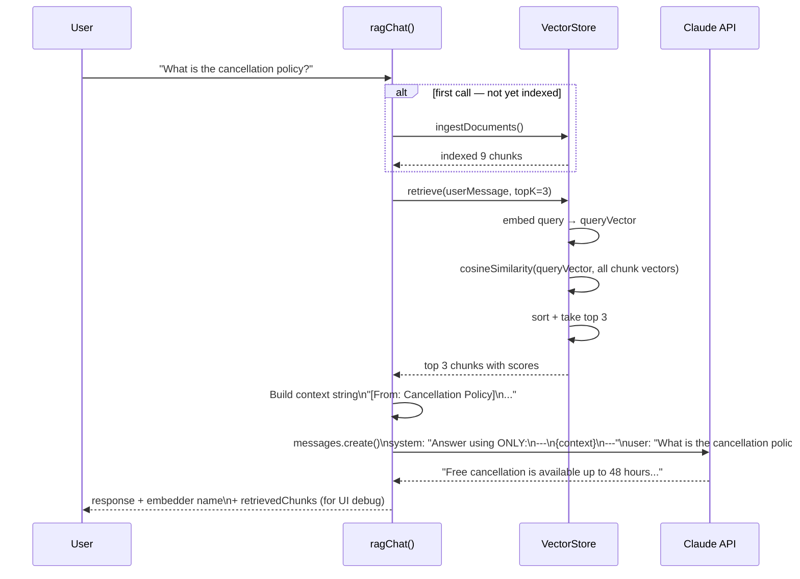
```mermaid
sequenceDiagram
    participant U as User
    participant RC as ragChat()
    participant VS as VectorStore
    participant C as Claude API

    U->>RC: "What is the cancellation policy?"

    alt first call — not yet indexed
        RC->>VS: ingestDocuments()
        VS-->>RC: indexed 9 chunks
    end

    RC->>VS: retrieve(userMessage, topK=3)
    VS->>VS: embed query → queryVector
    VS->>VS: cosineSimilarity(queryVector, all chunk vectors)
    VS->>VS: sort + take top 3
    VS-->>RC: top 3 chunks with scores

    RC->>RC: Build context string\n"[From: Cancellation Policy]\n..."

    RC->>C: messages.create()\nsystem: "Answer using ONLY:\n---\n{context}\n---"\nuser: "What is the cancellation policy?"

    C-->>RC: "Free cancellation is available up to 48 hours..."

    RC-->>U: response + embedder name\n+ retrievedChunks (for UI debug)
```

The four steps of RAG in one function:

| Step | Action | The "RAG" Letter |
|------|--------|-----------------|
| 1 | Retrieve top-3 chunks from vector store | **R**etrieval |
| 2 | Format chunks as readable context text | — |
| 3 | Inject context into the system prompt | **A**ugmented |
| 4 | Send augmented prompt to Claude | **G**eneration |

The response includes `retrievedChunks` so the UI can show exactly which chunks were surfaced. This is invaluable for debugging — you can see if retrieval is finding the right (or wrong) documents.

The system prompt says `"using ONLY the provided hotel information"` and `"Do not make up information not in the context."` This is how hallucination is blocked — the LLM is explicitly instructed not to go beyond what was retrieved.

---

## 7. compareRetrieval — Side-by-Side Debug Tool

```js
export const compareRetrieval = async (query, topK = 5) => {
  // ensures both stores are indexed
  const keywordResults = format(await keywordStore.retrieve(query, topK));
  const result = { query, keyword: keywordResults };
  if (realStore) {
    result.openai = format(await realStore.retrieve(query, topK));
  }
  return result;
};
```

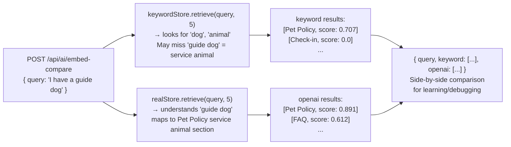
```mermaid
flowchart LR
    Q["`POST /api/ai/embed-compare
{ query: 'I have a guide dog' }`"]

    Q --> KR["`keywordStore.retrieve(query, 5)
→ looks for 'dog', 'animal'
May miss 'guide dog' = service animal`"]
    Q --> OR["realStore.retrieve(query, 5)\n→ understands 'guide dog'\nmaps to Pet Policy service animal section"]

    KR --> KRESP["`keyword results:
[Pet Policy, score: 0.707]
[Check-in, score: 0.0]
...`"]
    OR --> ORESP["`openai results:
[Pet Policy, score: 0.891]
[FAQ, score: 0.612]
...`"]

    KRESP & ORESP --> RESP["`{ query, keyword: [...], openai: [...] }
Side-by-side comparison
for learning/debugging`"]
```

Called via `POST /api/ai/embed-compare`. Returns both sets of results for the same query so you can compare:
- Which chunks each embedder surfaces
- The scores each assigns (binary-ish vs. continuous)
- Whether they agree or disagree on what's relevant

---

## 8. RAG Eval Setup

### The Eval Dataset (ragEvalCases)

`backend/src/evals/dataset.js` defines 10 RAG test cases. Each case specifies:

| Field              | Type       | Meaning                                                        |
|--------------------|------------|----------------------------------------------------------------|
| `id`               | string     | Unique case ID (e.g. `rag-001`)                               |
| `question`         | string     | The user question to ask the RAG pipeline                     |
| `expectedDocIds`   | string[]   | Which document(s) should be the source of retrieved chunks    |
| `expectedKeywords` | string[]   | Specific terms that must appear in the retrieved text         |
| `category`         | string     | Grouping label for analysis                                   |
| `shouldFail`       | boolean?   | If `true`, retrieval should return nothing relevant           |


```mermaid
flowchart LR
    subgraph CASES["10 RAG Eval Cases"]
        direction TB
        C1["`rag-001 policy
Cancellation policy
keywords: 48 hours, one night, non-refundable`"]
        C2["`rag-002 policy
Can I bring my dog?
keywords: 30 lbs, $75, pet fee, leash`"]
        C3["`rag-003 policy
Check-in time?
keywords: 3:00 PM, 12:00 PM, early, late`"]
        C4["`rag-004 loyalty
Gold tier benefits?
keywords: 15%, breakfast, upgrade, lounge`"]
        C5["`rag-005 amenities
Dining options?
keywords: Azure, room service, breakfast`"]
        C6["`rag-006 amenities
Massage cost?
keywords: $120, $140, Swedish, Deep Tissue`"]
        C7["`rag-007 faq
Parking cost?
keywords: valet, $35, self-parking, $25`"]
        C8["`rag-008 faq
Min check-in age?
keywords: 21, 18, guardian`"]
        C9["`rag-009 out-of-scope ⚠️
Helicopter pad?
shouldFail: true`"]
        C10["`rag-010 faq
WiFi speed + free?
keywords: WiFi, free, 25 Mbps, $15`"]
    end
```

### How runRagEvals Works

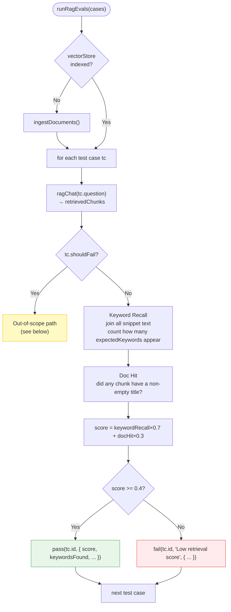
```mermaid
flowchart TD
    START(["runRagEvals(cases)"])
    START --> IDX{"`vectorStore
indexed?`"}
    IDX -->|No| ING["ingestDocuments()"]
    ING --> LOOP
    IDX -->|Yes| LOOP

    LOOP["for each test case tc"]
    LOOP --> RAG["`ragChat(tc.question)
→ retrievedChunks`"]

    RAG --> SF{tc.shouldFail?}

    SF -->|Yes| OOS["Out-of-scope path\n(see below)"]
    SF -->|No| KR

    KR["`Keyword Recall
join all snippet text
count how many expectedKeywords appear`"]
    KR --> DH["`Doc Hit
did any chunk have a non-empty title?`"]
    DH --> SCORE["score = keywordRecall×0.7 + docHit×0.3"]

    SCORE --> THRESH{score >= 0.4?}
    THRESH -->|Yes| PASS["`pass(tc.id, { score, keywordsFound, ... })`"]
    THRESH -->|No| FAIL["`fail(tc.id, 'Low retrieval score', { ... })`"]

    PASS & FAIL --> NEXT["next test case"]

    style PASS fill:#e8f5e9,stroke:#4CAF50
    style FAIL fill:#ffebee,stroke:#f44336
    style OOS fill:#fff9c4,stroke:#FFC107
```

### The Scoring Formula

The eval computes two signals and combines them into one score:

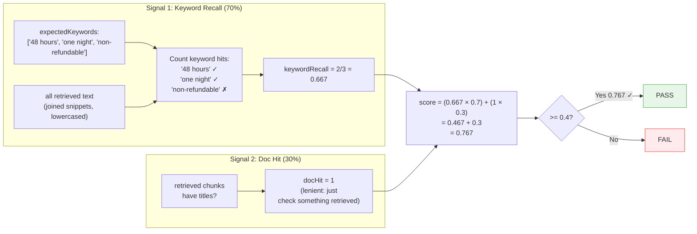
```mermaid
flowchart LR
    subgraph KR["Signal 1: Keyword Recall (70%)"]
        direction TB
        EK["`expectedKeywords:
['48 hours', 'one night', 'non-refundable']`"]
        RT["`all retrieved text
(joined snippets, lowercased)`"]
        EK & RT --> HIT["`Count keyword hits:
'48 hours' ✓
'one night' ✓
'non-refundable' ✗`"]
        HIT --> KRS["keywordRecall = 2/3 = 0.667"]
    end

    subgraph DH["Signal 2: Doc Hit (30%)"]
        direction TB
        CHUNKS["`retrieved chunks
have titles?`"]
        CHUNKS --> DHV["`docHit = 1
(lenient: just
check something retrieved)`"]
    end

    KRS --> FORMULA
    DHV --> FORMULA

    FORMULA["`score = (0.667 × 0.7) + (1 × 0.3)
      = 0.467 + 0.3
      = 0.767`"]

    FORMULA --> PASS2{">= 0.4?"}
    PASS2 -->|Yes 0.767 ✓| P["PASS"]
    PASS2 -->|No| F["FAIL"]

    style P fill:#e8f5e9,stroke:#4CAF50
    style F fill:#ffebee,stroke:#f44336
```

**Pass threshold: score >= 0.4**

A case passes if at least ~57% of expected keywords appear in the retrieved text (which alone gives 0.7 × 0.57 ≈ 0.4) regardless of doc hit. The 0.4 threshold is permissive by design because this is a teaching project — strict thresholds would cause many false failures with the simple keyword embedder.

What gets reported:
- `score` — the composite float
- `keywordRecall` — e.g. `"3/4"`
- `keywordsFound` — which keywords were actually in the retrieved text
- `keywordsMissed` — which keywords were not found (useful for debugging)
- `chunks` — the raw retrieved chunks with their scores

### The shouldFail / Out-of-Scope Test

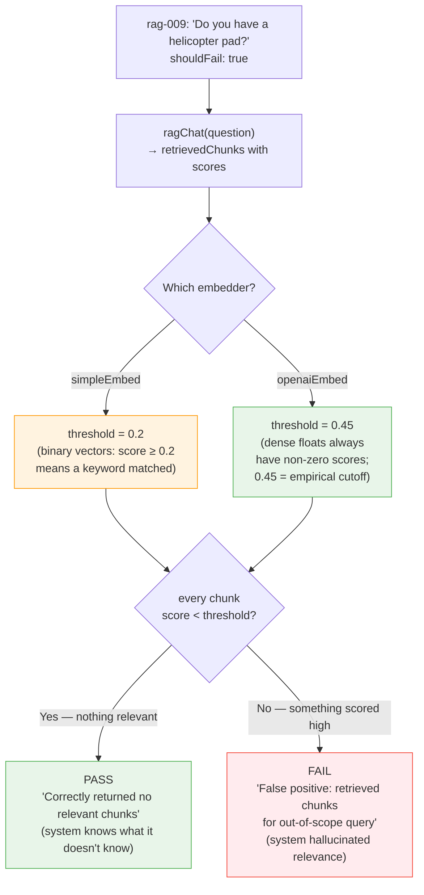
```mermaid
flowchart TD
    TC["`rag-009: 'Do you have a helicopter pad?'
shouldFail: true`"]
    TC --> RAG2["`ragChat(question)
→ retrievedChunks with scores`"]

    RAG2 --> THRESH2{"Which embedder?"}
    THRESH2 -->|simpleEmbed| T1["`threshold = 0.2
(binary vectors: score ≥ 0.2
means a keyword matched)`"]
    THRESH2 -->|openaiEmbed| T2["`threshold = 0.45
(dense floats always
have non-zero scores;
0.45 = empirical cutoff)`"]

    T1 & T2 --> CHECK{"`every chunk
score < threshold?`"}

    CHECK -->|Yes — nothing relevant| PASS3["`PASS
'Correctly returned no relevant chunks'
(system knows what it doesn't know)`"]
    CHECK -->|No — something scored high| FAIL3["`FAIL
'False positive: retrieved chunks
for out-of-scope query'
(system hallucinated relevance)`"]

    style PASS3 fill:#e8f5e9,stroke:#4CAF50
    style FAIL3 fill:#ffebee,stroke:#f44336
    style T2 fill:#e8f5e9,stroke:#4CAF50
    style T1 fill:#fff3e0,stroke:#FF9800
```

Test case `rag-009` asks about a helicopter pad — something not in any document. This tests that the system does *not* hallucinate a retrieved chunk.

**Adaptive threshold:** the threshold differs by embedder:
- `simpleEmbed`: 0.2 — binary vectors produce scores in discrete steps; anything at 0.2 or above means at least one keyword matched.
- `openaiEmbed`: 0.45 — semantic embeddings always return non-zero scores even for unrelated text because of how dense float vectors work; 0.45 is the empirically tuned point below which the match is not meaningful.

---

## 9. The Other Three Eval Types

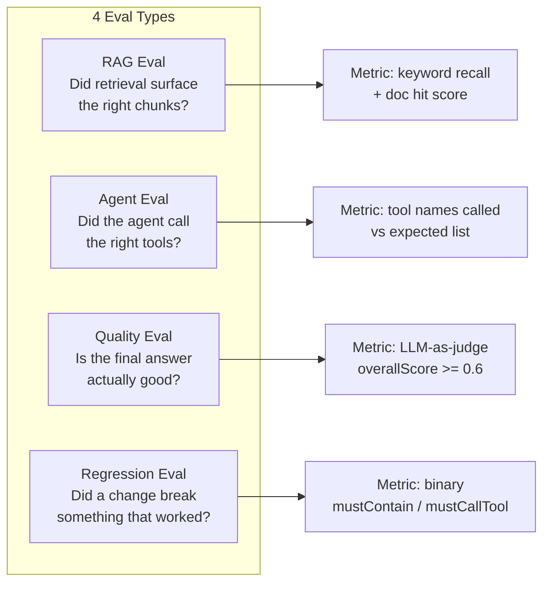
```mermaid
flowchart LR
    subgraph FOUR["4 Eval Types"]
        RAG_E["`RAG Eval
Did retrieval surface
the right chunks?`"]
        AGT_E["`Agent Eval
Did the agent call
the right tools?`"]
        QUA_E["`Quality Eval
Is the final answer
actually good?`"]
        REG_E["`Regression Eval
Did a change break
something that worked?`"]
    end

    RAG_E --> RM["`Metric: keyword recall
+ doc hit score`"]
    AGT_E --> AM["`Metric: tool names called
vs expected list`"]
    QUA_E --> QM["`Metric: LLM-as-judge
overallScore >= 0.6`"]
    REG_E --> RM2["`Metric: binary
mustContain / mustCallTool`"]
```

### Agent Eval

**File:** `runner.js → runAgentEvals()`, dataset `agentEvalCases`

Tests the ReAct agent loop: does the agent call the right tools with the right inputs?

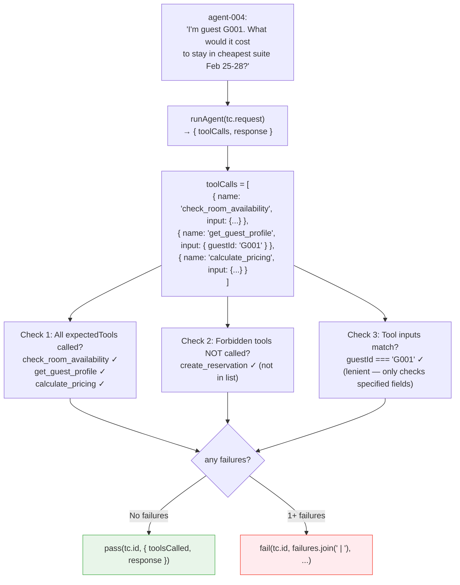
```mermaid
flowchart TD
    TC2["`agent-004:
'I'm guest G001. What would it cost
to stay in cheapest suite Feb 25-28?'`"]

    TC2 --> RUN["`runAgent(tc.request)
→ { toolCalls, response }`"]

    RUN --> TOOLS["`toolCalls = [
  { name: 'check_room_availability', input: {...} },
  { name: 'get_guest_profile', input: { guestId: 'G001' } },
  { name: 'calculate_pricing', input: {...} }
]`"]

    TOOLS --> C1_["`Check 1: All expectedTools called?
check_room_availability ✓
get_guest_profile ✓
calculate_pricing ✓`"]

    TOOLS --> C2_["`Check 2: Forbidden tools NOT called?
create_reservation ✓ (not in list)`"]

    TOOLS --> C3_["`Check 3: Tool inputs match?
guestId === 'G001' ✓
(lenient — only checks specified fields)`"]

    C1_ & C2_ & C3_ --> RESULT{any failures?}
    RESULT -->|No failures| PASS4["`pass(tc.id, { toolsCalled, response })`"]
    RESULT -->|1+ failures| FAIL4["`fail(tc.id, failures.join(' | '), ...)`"]

    style PASS4 fill:#e8f5e9,stroke:#4CAF50
    style FAIL4 fill:#ffebee,stroke:#f44336
```

**Why this matters:** agents can develop subtle regressions. Maybe a prompt change causes the agent to skip calling `check_room_availability` before `create_reservation`. Agent evals catch this automatically.

### Quality Eval (LLM-as-Judge)

**File:** `runner.js → runQualityEvals()`, dataset `qualityEvalCases`

Tests not just *what* was retrieved, but *how good* the final answer is.

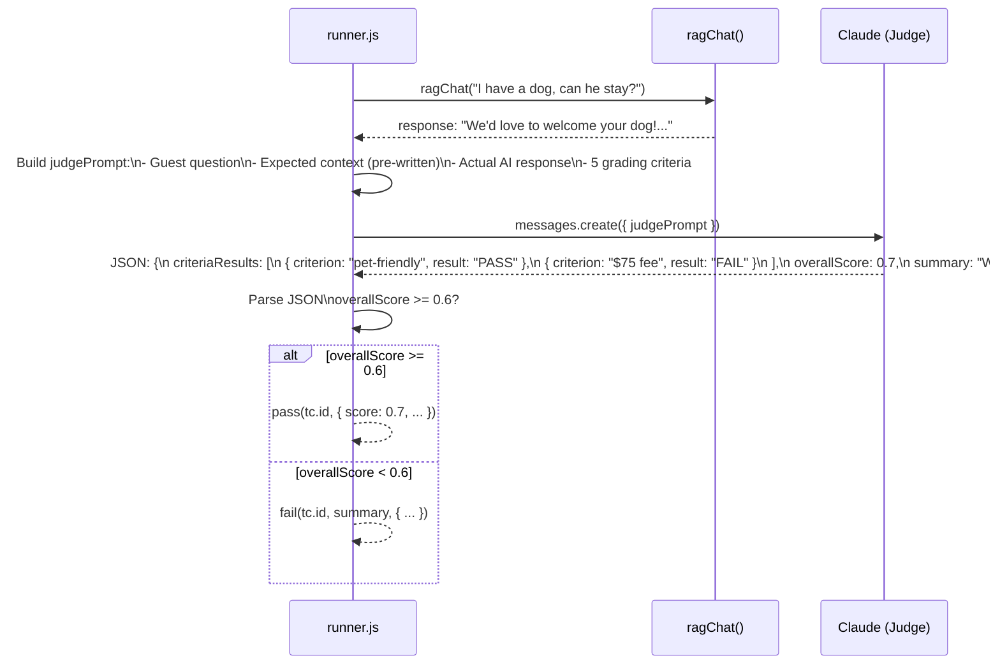
```mermaid
sequenceDiagram
    participant R as runner.js
    participant RAG as ragChat()
    participant J as Claude (Judge)

    R->>RAG: ragChat("I have a dog, can he stay?")
    RAG-->>R: response: "We'd love to welcome your dog!..."

    R->>R: Build judgePrompt:\n- Guest question\n- Expected context (pre-written)\n- Actual AI response\n- 5 grading criteria

    R->>J: messages.create({ judgePrompt })
    J-->>R: JSON: {\n  criteriaResults: [\n    { criterion: "pet-friendly", result: "PASS" },\n    { criterion: "$75 fee", result: "FAIL" }\n  ],\n  overallScore: 0.7,\n  summary: "Warm but missed fee"\n}

    R->>R: Parse JSON\noverallScore >= 0.6?

    alt overallScore >= 0.6
        R-->>R: pass(tc.id, { score: 0.7, ... })
    else overallScore < 0.6
        R-->>R: fail(tc.id, summary, { ... })
    end
```

Each test case has:
- `question` — user question
- `context` — the expected/ideal context (pre-written, not retrieved live)
- `gradingCriteria` — array of strings, each a criterion to evaluate

**The hallucination test (qual-004):** passes a context of `"No relevant hotel information found"` and checks that the response does NOT invent an answer. Criteria include "Does NOT claim the hotel has a helicopter pad" and "Politely acknowledges it cannot find that information."

**Limitation acknowledged in the code:** the judge LLM can be biased. A Claude judge may favour Claude-style responses. Mitigation: write very explicit, objective rubrics.

### Regression Eval

**File:** `runner.js → runRegressionEvals()`, dataset `regressionEvalCases`

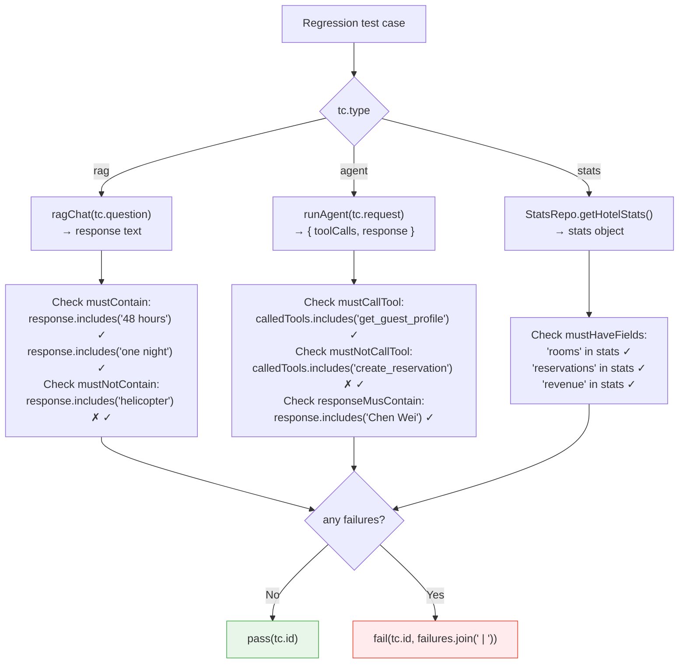
```mermaid
flowchart TD
    TC3["Regression test case"]

    TC3 --> TYPE{tc.type}

    TYPE -->|rag| RAGR["`ragChat(tc.question)
→ response text`"]
    TYPE -->|agent| AGTR["`runAgent(tc.request)
→ { toolCalls, response }`"]
    TYPE -->|stats| STATSR["`StatsRepo.getHotelStats()
→ stats object`"]

    RAGR --> RAGC["`Check mustContain:
  response.includes('48 hours') ✓
  response.includes('one night') ✓
Check mustNotContain:
  response.includes('helicopter') ✗ ✓`"]

    AGTR --> AGTC["`Check mustCallTool:
  calledTools.includes('get_guest_profile') ✓
Check mustNotCallTool:
  calledTools.includes('create_reservation') ✗ ✓
Check responseMusContain:
  response.includes('Chen Wei') ✓`"]

    STATSR --> STATSC["`Check mustHaveFields:
  'rooms' in stats ✓
  'reservations' in stats ✓
  'revenue' in stats ✓`"]

    RAGC & AGTC & STATSC --> PASSF{any failures?}
    PASSF -->|No| PASS5["pass(tc.id)"]
    PASSF -->|Yes| FAIL5["`fail(tc.id, failures.join(' | '))`"]

    style PASS5 fill:#e8f5e9,stroke:#4CAF50
    style FAIL5 fill:#ffebee,stroke:#f44336
```

Three sub-types:

- **`type: 'rag'`** — calls `ragChat`, checks the final response text for required/forbidden strings.
- **`type: 'agent'`** — calls `runAgent`, checks both which tools were called AND that the response text contains expected values.
- **`type: 'stats'`** — calls `StatsRepo.getHotelStats()` directly and checks that required fields exist. Catches DB/repository regressions independent of the AI layer.

Regression evals are the fastest to run (binary pass/fail) and cheapest (fewer LLM calls). They function like unit tests — run them on every change.

---

## 10. Full Suite and Reporting

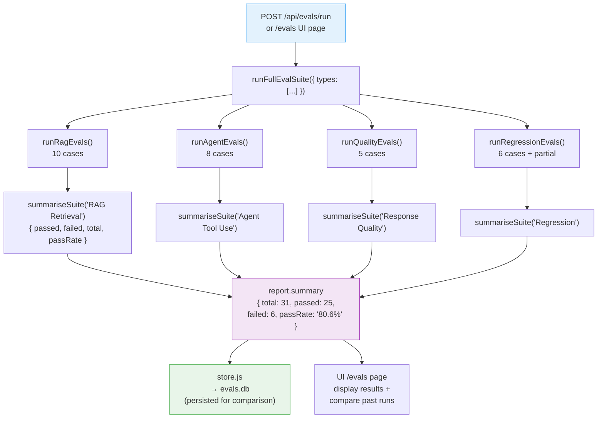
```mermaid
flowchart TD
    TRIGGER["`POST /api/evals/run
or /evals UI page`"]

    TRIGGER --> SUITE["runFullEvalSuite({ types: [...] })"]

    SUITE --> R1["`runRagEvals()
10 cases`"]
    SUITE --> R2["`runAgentEvals()
8 cases`"]
    SUITE --> R3["`runQualityEvals()
5 cases`"]
    SUITE --> R4["`runRegressionEvals()
6 cases + partial`"]

    R1 --> S1["`summariseSuite('RAG Retrieval')
{ passed, failed, total, passRate }`"]
    R2 --> S2["summariseSuite('Agent Tool Use')"]
    R3 --> S3["summariseSuite('Response Quality')"]
    R4 --> S4["summariseSuite('Regression')"]

    S1 & S2 & S3 & S4 --> SUM["`report.summary
{ total: 31, passed: 25,
  failed: 6, passRate: '80.6%' }`"]

    SUM --> STORE2["`store.js
→ evals.db
(persisted for comparison)`"]
    SUM --> UI["`UI /evals page
display results +
compare past runs`"]

    style TRIGGER fill:#e3f2fd,stroke:#2196F3
    style SUM fill:#f3e5f5,stroke:#9C27B0
    style STORE2 fill:#e8f5e9,stroke:#4CAF50
```

The `summariseSuite` helper wraps each suite's results:
```js
{
  name: 'RAG Retrieval',
  results: [...],    // individual case results
  passed: 7,
  failed: 3,
  total: 10,
  passRate: '70.0%'
}
```

Triggered via `POST /api/evals/run` (or the `/evals` UI page). Results are stored in `backend/data/evals.db` by `store.js` so you can compare runs over time.

---

## 11. Key Concepts to Take Away

```mermaid
mindmap
  root((HotelAI RAG\n& Evals))
    Embedding
      simpleEmbed
        44-dim binary
        No API needed
        Keyword matching only
      openaiEmbed
        1536-dim float
        Semantic meaning
        Requires OPENAI_API_KEY
      Cosine Similarity
        Measures angle not length
        1.0 = identical
        0.0 = unrelated
    VectorStore
      Chunking
        400 words per chunk
        Inherits doc metadata
      Indexing
        Embed all chunks once
        Parallel arrays
        isIndexed flag
      Retrieval
        Embed query
        Score all chunks
        Return top-K
    RAG Pipeline
      R - Retrieve top chunks
      A - Augment system prompt
      G - Generate with Claude
      Lazy indexing on first call
      Strategy pattern for embedder swap
    Evals
      RAG Eval
        Keyword recall 70%
        Doc hit 30%
        Threshold 0.4
        shouldFail negative test
      Agent Eval
        Tool name checks
        Forbidden tool checks
        Input value checks
      Quality Eval
        LLM-as-judge
        Rubric scoring
        Pass at 0.6
      Regression Eval
        mustContain checks
        mustCallTool checks
        Binary pass/fail
```

| Concept | Where | What it teaches |
|---------|-------|-----------------|
| Binary keyword embedding | `simpleEmbed` | Baseline retrieval, no API needed, fast but dumb |
| Dense semantic embedding | `openaiEmbed` | Real-world RAG, handles synonyms and context |
| Cosine similarity | `VectorStore.cosineSimilarity` | The math behind "how similar are these two texts?" |
| Chunking | `VectorStore.chunkDocument` | Why you don't embed whole documents |
| Lazy indexing | `ragChat` checks `isIndexed` | Index once, retrieve many times |
| Strategy pattern | `VectorStore(name, embedFn)` | Swap embedders without changing retrieval logic |
| Keyword recall | RAG eval scoring | Standard IR metric: did we find the relevant terms? |
| Doc hit | RAG eval scoring | Did we retrieve from the right source? |
| Negative test (shouldFail) | `rag-009` | Test that the system knows what it doesn't know |
| Adaptive threshold | shouldFail check | Different embedders need different score cutoffs |
| LLM-as-judge | Quality eval | A second LLM grades the first one's answer |
| Regression safety net | Regression eval | Binary checks that survive code changes |
| Eval loop | All evals | Baseline → change → re-run → compare |
